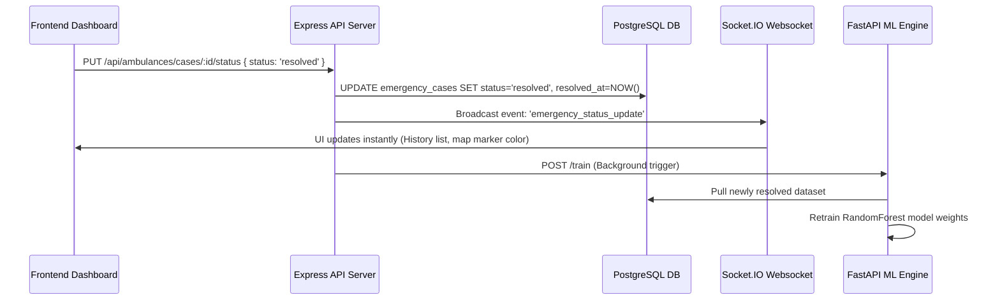

# IERBMS Algorithmic Architecture Specification

This document details the core mathematical models, logic flows, and algorithms implemented across the **Integrated Emergency Resource & Bed Management System (IERBMS)**. These algorithms drive real-time routing, predictive dispatch, physical live simulation, and continuous learning.

---

## 1. AI-Powered Hospital Routing Recommendation

### Objective
To determine the optimal hospital destination $H^*$ for an incoming emergency case based on patient trauma severity, distance, and real-time hospital resource capabilities.

### Math Model
Let $A$ be the ambulance location ($lat_A, lon_A$) and $T$ be the trauma level ($1 \leq T \leq 5$).
For each hospital $h \in \mathcal{H}$:
- **Distance ($d_h$)**: Calculated as the Euclidean distance (scaled mapping) or Haversine distance:
  $$d_h = \sqrt{(lat_h - lat_A)^2 + (lon_h - lon_A)^2}$$
- **General Bed Occupancy Rate ($O_{gen, h}$)**:
  $$O_{gen, h} = \frac{\text{Occupied General Beds}}{\text{Total General Beds}}$$
- **ICU Bed Occupancy Rate ($O_{icu, h}$)**:
  $$O_{icu, h} = \frac{\text{Occupied ICU Beds}}{\text{Total ICU Beds}}$$

#### Score Calculation Formula:
$$S(h) = \begin{cases} 
      -\infty & \text{if } T \ge 4 \text{ and } O_{icu, h} \ge 1.0 \text{ (No ICU capacity)} \\
      -\infty & \text{if } T < 4 \text{ and } O_{gen, h} \ge 1.0 \text{ (No general capacity)} \\
      (1 - O_{icu, h}) \times 100 - (d_h \times 10) & \text{if } T \ge 4 \\
      (1 - O_{gen, h}) \times 100 - (d_h \times 10) & \text{if } T < 4
   \end{cases}$$

### Python Implementation
*Source Location: [routing_model.py](file:///Users/kwabenabrefo/FINAL%20YEAR%20PROJECT/ml-engine/models/routing_model.py)*

```python
def recommend_hospitals(amb_lat, amb_lon, trauma_level, hospitals):
    scored_hospitals = []
    for h in hospitals:
        distance = calculate_distance(amb_lat, amb_lon, h.latitude, h.longitude)
        general_capacity = (h.total_general_beds - h.occupied_general_beds) / (h.total_general_beds or 1)
        icu_capacity = (h.total_icu_beds - h.occupied_icu_beds) / (h.total_icu_beds or 1)
        
        score = 0
        if trauma_level >= 4:
            if icu_capacity <= 0:
                score = -9999  # Critical trauma requires ICU; penalize to exclude
            else:
                score = (icu_capacity * 100) - (distance * 10)
        else:
            if general_capacity <= 0:
                score = -9999  # Standard cases require general beds
            else:
                score = (general_capacity * 100) - (distance * 10)
                
        scored_hospitals.append({
            "hospital_id": h.id,
            "score": round(score, 2),
            "distance_estimate": round(distance, 4)
        })
    scored_hospitals.sort(key=lambda x: x['score'], reverse=True)
    return scored_hospitals
```

---

## 2. ML Engine Retraining Loop (Random Forest Regressor)

### Objective
To predict the total resolution/turnaround time ($y$) of an emergency case at a given hospital based on historical patterns, allowing the router to eventually swap static weightings for dynamic estimated time of arrival/treatment predictions.

### Algorithm Description
1. **Feature Engineering**:
   - $X_1$: `trauma_level`
   - $X_2$: `occupancy_rate` ($\frac{\text{occupied\_beds}}{\text{total\_beds}}$)
2. **Label ($y$)**:
   - Treatment Turnaround Time in minutes:
     $$y = \text{resolved\_at} - \text{created\_at}$$
3. **Regressor**:
   - Scikit-Learn `RandomForestRegressor(n_estimators=50, random_state=42)` is trained to minimize the Mean Squared Error (MSE):
     $$\text{MSE} = \frac{1}{n} \sum_{i=1}^n (y_i - \hat{y}_i)^2$$

### Python Pseudocode
*Source Location: [main.py](file:///Users/kwabenabrefo/FINAL%20YEAR%20PROJECT/ml-engine/main.py)*

```python
# Connect to DB and load resolved cases
query = """
    SELECT trauma_level, occupied_general_beds, total_general_beds,
           EXTRACT(EPOCH FROM (resolved_at - created_at))/60 as resolution_time_mins
    FROM emergency_cases c
    JOIN hospitals h ON c.assigned_hospital_id = h.id
    WHERE c.status = 'resolved' AND c.resolved_at IS NOT NULL
"""
df = pd.read_sql(query, conn)
df['occupancy_rate'] = df['occupied_general_beds'] / df['total_general_beds'].replace(0, 1)

# Fit Random Forest Regressor
X = df[['trauma_level', 'occupancy_rate']]
y = df['resolution_time_mins']
model = RandomForestRegressor(n_estimators=50, random_state=42)
model.fit(X, y)

# Save model parameters
joblib.dump(model, "weights/routing_model.pkl")
```

---

## 3. Kinematic Ambulance GPS Movement Simulator

### Objective
To update coordinates of in-transit ambulances step-by-step toward their target hospitals, simulating continuous motion in real time.

### Mathematical Formulation
Let the current position of the ambulance be $\vec{P}(t) = [lat(t), lon(t)]$ and target hospital position be $\vec{T} = [lat_T, lon_T]$.
1. **Direction Vector**:
   $$\vec{D} = \vec{T} - \vec{P}(t) = [\Delta lat, \Delta lon]$$
2. **Distance**:
   $$d = \|\vec{D}\| = \sqrt{(\Delta lat)^2 + (\Delta lon)^2}$$
3. **Normalized Step Update**:
   Let $s$ be the velocity (speed factor per tick, e.g., $0.0005$ degrees $\approx 50$ meters).
   - If $d > s$, the new position is:
     $$\vec{P}(t+1) = \vec{P}(t) + s \frac{\vec{D}}{d}$$
   - If $d \le s$, the ambulance has arrived:
     $$\vec{P}(t+1) = \vec{T}$$

### Node.js Implementation
*Source Location: [simulator.js](file:///Users/kwabenabrefo/FINAL%20YEAR%20PROJECT/backend/src/simulator.js)*

```javascript
const speed = 0.0005; // 50m per interval tick
let dLat = transit.target_lat - transit.current_latitude;
let dLng = transit.target_lng - transit.current_longitude;
const dist = Math.sqrt(dLat*dLat + dLng*dLng);

let newLat = transit.target_lat;
let newLng = transit.target_lng;

if (dist > speed) {
  // Translate coordinate position step-wise
  newLat = transit.current_latitude + (dLat / dist) * speed;
  newLng = transit.current_longitude + (dLng / dist) * speed;
}

// Write new coordinates to database
await db.query(
  'UPDATE ambulances SET current_latitude = $1, current_longitude = $2 WHERE id = $3',
  [newLat, newLng, transit.ambulance_id]
);
// Emit update to WebSocket clients
io.emit('ambulance_location_update', { id: transit.ambulance_id, lat: newLat, lng: newLng });
```

---

## 4. Real-time Event-Driven Synchronization

### Objective
Ensures zero-latency updates propagate across the system when emergency states transition (`active` $\rightarrow$ `in-transit` $\rightarrow$ `arrived` $\rightarrow$ `resolved`).

### Workflow

