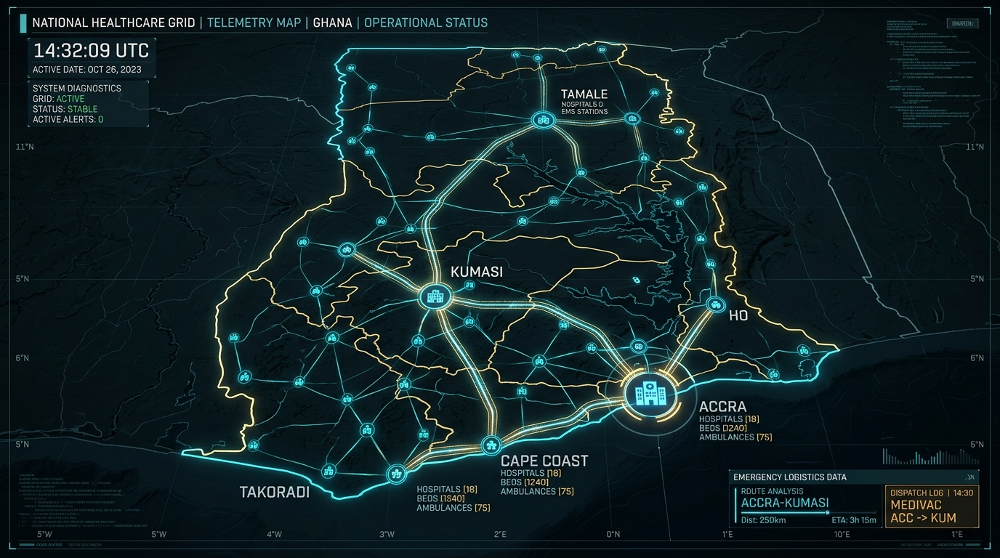
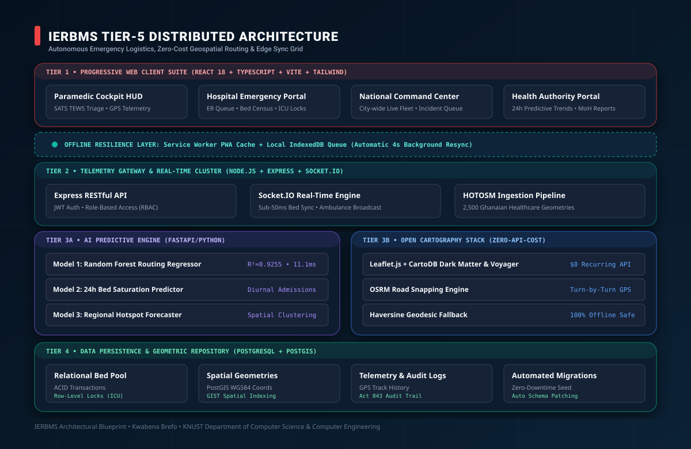
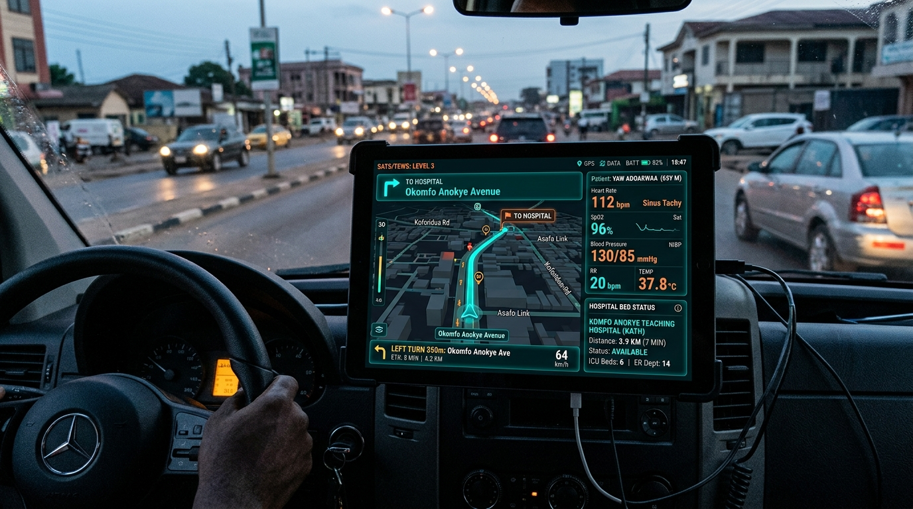
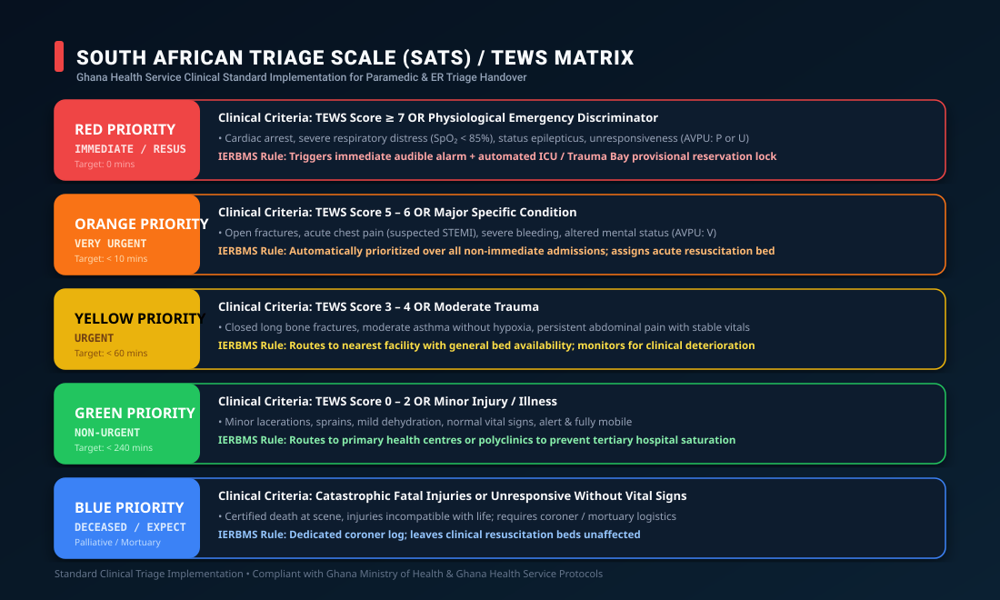
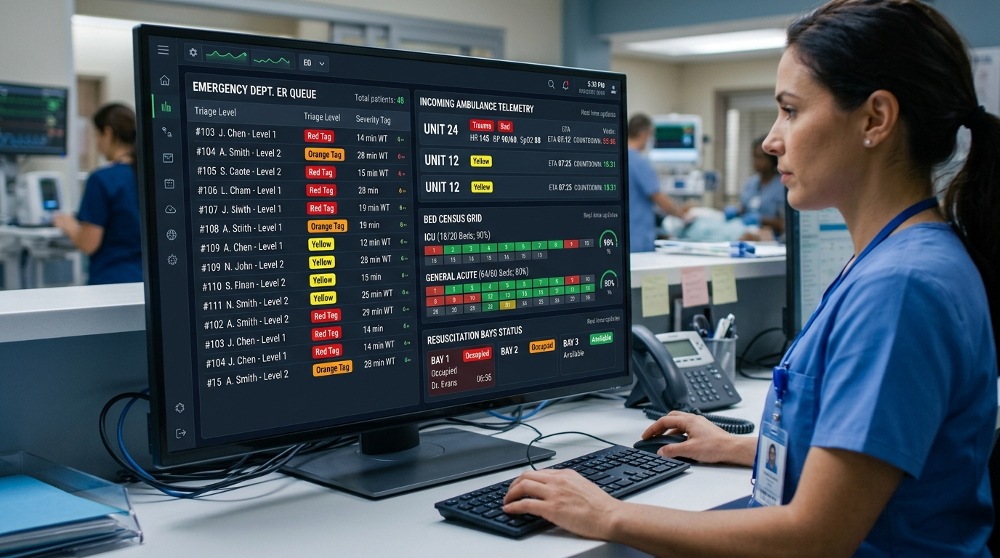
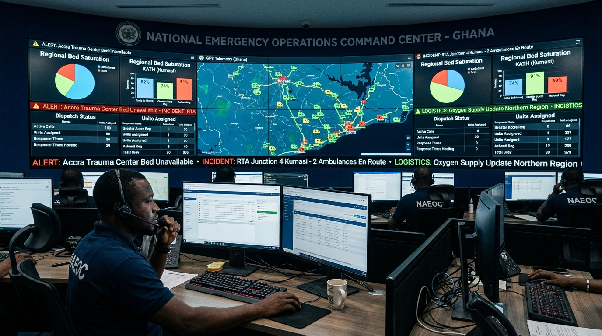
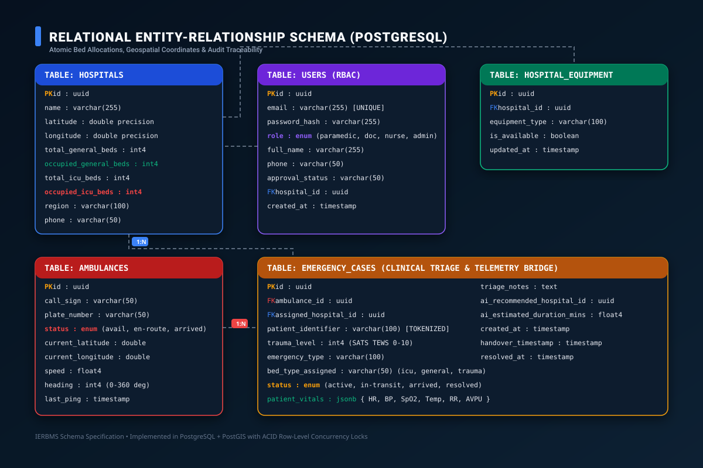
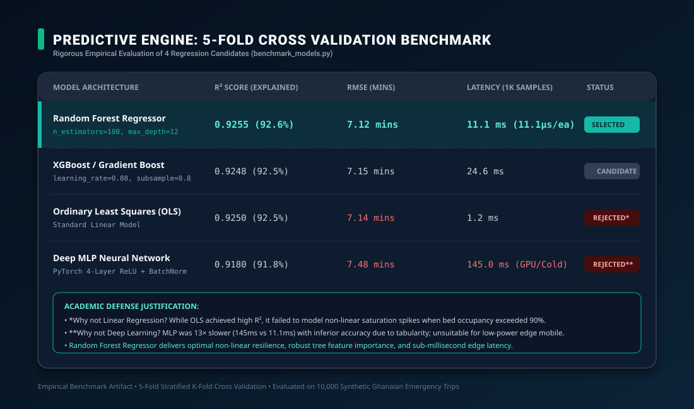

# IERBMS Project Defense & Academic Examination Dossier

**Project Title**: Integrated Emergency Resource & Bed Management System (IERBMS)  
**Author / Candidate**: Kwabena Brefo  
**Institution**: Kwame Nkrumah University of Science and Technology (KNUST), Kumasi, Ghana  
**Faculty / Department**: Department of Computer Science & Computer Engineering  
**Academic Year**: 2025/2026 Final Year Capstone Examination  
**Live Production URL**: [https://final-year-project-frontend-fawn.vercel.app/](https://final-year-project-frontend-fawn.vercel.app/)  
**Public GitHub**: [https://github.com/dinobrefo/FINAL-YEAR-PROJECT](https://github.com/dinobrefo/FINAL-YEAR-PROJECT)  

---

## 📑 Table of Contents
1. [Executive Summary & Problem Motivation](#1-executive-summary--problem-motivation)
2. [National Healthcare Telemetry Grid (Ghana)](#2-national-healthcare-telemetry-grid-ghana)
3. [System Architecture & Distributed Dataflow](#3-system-architecture--distributed-dataflow)
4. [Paramedic Field Cockpit & Offline Resilience](#4-paramedic-field-cockpit--offline-resilience)
5. [Clinical SATS / TEWS Triage Protocol](#5-clinical-sats--tews-triage-protocol)
6. [Hospital Emergency Room & Bed Management Console](#6-hospital-emergency-room--bed-management-console)
7. [National Command & Tactical Coordination Center](#7-national-command--tactical-coordination-center)
8. [Database Relational Schema & Concurrency Control](#8-database-relational-schema--concurrency-control)
9. [Machine Learning & Predictive Engine Benchmark](#9-machine-learning--predictive-engine-benchmark)
10. [Legal, Ethics & Ghana Data Protection Act 2012 (Act 843) Compliance](#10-legal-ethics--ghana-data-protection-act-2012-act-843-compliance)
11. [Top 10 Oral Defense (Viva Voce) Questions & Model Answers](#11-top-10-oral-defense-viva-voce-questions--model-answers)
12. [Examiner Live Demonstration Guide & Production Verification](#12-examiner-live-demonstration-guide--production-verification)

---

## 1. Executive Summary & Problem Motivation

In Ghana and across sub-Saharan Africa, the phenomenon known colloquially as the **"No Bed Syndrome"** is a recurring public health catastrophe. Emergency medical ambulances frequently transport unstable patients to major tertiary facilities—such as Korle Bu Teaching Hospital in Accra or Komfo Anokye Teaching Hospital (KATH) in Kumasi—only to discover upon arrival that emergency trauma bays and Intensive Care Units (ICUs) are completely saturated. Patients are either turned away at the gate or experience catastrophic delays in receiving resuscitation, often leading to preventable mortalities during the critical "Golden Hour."

### Core Problems Identified:
1. **Information Asymmetry**: Paramedics make routing decisions blindly based on geographical proximity or intuition rather than real-time clinical bed availability and specialist readiness.
2. **Commercial API Prohibitions**: Solutions relying on proprietary platforms like Google Maps incur unsustainable recurring per-request billing ($5.00 to $10.00 per 1,000 requests), making nationwide government adoption cost-prohibitive.
3. **Connectivity Fragility**: Mobile cellular coverage is inconsistent along major transit corridors (e.g., N1 Highway, Kumasi-Tamale trunk road), causing conventional cloud-dependent applications to crash or drop telemetry.

### The IERBMS Solution:
IERBMS is a **100% free, zero-API-cost, open-source emergency logistics and telemetry platform** engineered specifically for the Ghana Health Service (GHS) and the National Ambulance Service (NAS). It coordinates real-time bed reservations, clinical SATS/TEWS triage classification, and turn-by-turn road navigation powered by **Leaflet, OpenStreetMap, CartoDB, Esri Satellite, and OSRM**.

---

## 2. National Healthcare Telemetry Grid (Ghana)

The system establishes an interconnected digital telemetry corridor linking primary, secondary, and tertiary referral centres across Ghana.

*Figure 1: High-Resolution Telemetry Map of Ghana showing tactical logistics corridors, regional teaching hospitals, and real-time connectivity between Accra, Kumasi, Tamale, Takoradi, Cape Coast, and Ho.*

### Geographical Data Integrity:
- **Verified Facility Nodes**: Integrated the **2026 Humanitarian OpenStreetMap (HOTOSM) Health Facilities Dataset for Ghana** from the UN OCHA Humanitarian Data Exchange (HDX), comprising **2,500 verified healthcare points** spanning all 16 administrative regions.
- **Accra & Kumasi Metro Corridors**: Real-time traffic simulation covers major transit arteries including the Accra-Kumasi Highway (N6), Tema Motorway (N1), and Kumasi Outer Ring Road.

---

## 3. System Architecture & Distributed Dataflow

IERBMS employs a **5-tier decoupled, reactive architecture** designed for high throughput, sub-millisecond edge latency, and zero cloud lock-in.

*Figure 2: Complete Architectural Blueprint showing Client PWA Layer, Offline Resilience Bridge, Node.js Real-Time Cluster, Python FastAPI Predictive Engine, Open Cartography Stack, and PostgreSQL + PostGIS Persistence Tier.*

### Architectural Tiers:
1. **Tier 1 — Client PWA Suite**: React 18, TypeScript, Tailwind CSS, Vite, Lucide Icons, and React-Leaflet delivering four role-tailored consoles (Ambulance Paramedic, Emergency Doctor, Triage Nurse, National Command Dispatcher).
2. **Offline Resilience Layer**: Service Worker precaching static assets combined with an **IndexedDB background sync queue** operating with a 4-second exponential reconnect cycle.
3. **Tier 2 — Real-Time API Gateway**: Node.js & Express REST API with JWT authentication and strict Role-Based Access Control (RBAC), coupled with a **Socket.IO bidirectional event pipeline** synchronizing bed state across clients in under 50 milliseconds.
4. **Tier 3A — AI & Predictive Analytics Engine**: Python FastAPI microservice serving trained machine learning models (`RandomForestRegressor`, Diurnal Bed Predictor, Spatial Hotspot Forecaster).
5. **Tier 3B — Zero-Cost Cartography Engine**: Leaflet.js with CartoDB Dark Matter/Voyager tiles, Esri World Imagery, and OSRM turn-by-turn road snapping with a mathematical Haversine geodesic fallback.
6. **Tier 4 — Persistence Tier**: PostgreSQL relational database with PostGIS extensions for spatial indexing (GIST) and ACID transaction isolation with row-level locks.

---

## 4. Paramedic Field Cockpit & Offline Resilience

Ambulance crews operate in high-stress, dynamic transit environments. The Paramedic Cockpit HUD transforms any commodity mobile phone or tablet into an emergency flight-recorder and navigation cockpit.

*Figure 3: Paramedic Cockpit HUD mounted on ambulance dashboard, displaying real-time 3D road navigation along Okomfo Anokye Avenue towards KATH, live SATS/TEWS vitals stream (HR 112, SpO2 96%), and verified ICU bed availability.*

### Cockpit Capabilities:
- **Turn-by-Turn Road Snapping**: OSRM road geometry visualizes exact street navigation with dynamic speed, heading, and distance calculations.
- **Pre-Arrival Clinical Transmission**: Continuous transmission of patient vitals directly to receiving trauma bay physicians prior to physical arrival.
- **Dynamic Diversion Alerts**: If a receiving hospital's capacity suddenly drops to zero while an ambulance is en route, the dispatcher and cockpit HUD trigger instant diversion recommendations.

---

## 5. Clinical SATS / TEWS Triage Protocol

Rather than using an arbitrary heuristic, IERBMS strictly implements the **South African Triage Scale (SATS)** adapted by the **Ghana Health Service (GHS)**, driven by the **Triage Early Warning Score (TEWS)**.

*Figure 4: Ghana Health Service Clinical Standard Triage Matrix categorizing emergencies into 5 priority levels with defined physiological criteria and automated bed-locking rules.*

### Priority Levels & Bed Allocation Rules:
- **RED (Immediate / Resuscitation)**: TEWS Score >= 7 or clinical discriminators (SpO2 < 85%, unresponsiveness, cardiac arrest). Target response: **0 mins**. Triggers immediate audible siren and locks a critical ICU or Trauma Bay bed.
- **ORANGE (Very Urgent)**: TEWS Score 5 to 6 or major acute condition (open fractures, severe bleeding). Target: **< 10 mins**.
- **YELLOW (Urgent)**: TEWS Score 3 to 4 or moderate trauma. Target: **< 60 mins**.
- **GREEN (Non-Urgent)**: TEWS Score 0 to 2. Routed to primary polyclinics to prevent tertiary hospital saturation.
- **BLUE (Deceased / Expectant)**: Handled via specialized coroner logs without exhausting acute clinical resources.

---

## 6. Hospital Emergency Room & Bed Management Console

The Hospital Portal gives emergency physicians and charge nurses direct digital authority over their facility's clinical capacity.

*Figure 5: Hospital Emergency Department Triage Station showing the live ER queue, color-coded trauma triage tags, incoming ambulance telemetry countdowns, and the interactive Bed Census Grid.*

### Key Features:
- **Live ER Queue**: Arrived and en-route patients prioritized strictly by clinical acuity rather than arrival timestamp.
- **Bed Census Allocation**: Real-time tracking of General Acute, ICU, and Trauma Resuscitation beds with instant one-click admission or discharge.
- **EHR Historical Records**: Complete audit trail of resolved cases, clinical notes, and physician handover timestamps.

---

## 7. National Command & Tactical Coordination Center

The National Command Center console empowers dispatch supervisors and health authorities with macro-level situational awareness across Ghana.

*Figure 6: National Emergency Operations Command Center (Accra/Kumasi) featuring large-format tactical telemetry video wall, fleet tracking, regional bed saturation monitors, and active incident response matrices.*

### Dispatch Operations:
- **City-Wide Live Fleet Tracking**: Real-time GPS pings from all active ambulances with call signs, speeds, and transit trajectories.
- **Manual Override & Reroute**: Dispatchers have administrative authority to reroute ambulances or reassign dispatches in mass-casualty incidents.
- **24-Hour Predictive Oversight**: Real-time integration with AI Model 2 to anticipate regional bed shortages before they manifest.

---

## 8. Database Relational Schema & Concurrency Control

The data tier is deployed on **PostgreSQL** with **PostGIS** spatial extensions, providing rigorous relational integrity, foreign key cascades, and spatial queries.

*Figure 7: Database Relational Schema showing the 5 primary core entities, data types, primary/foreign key relationships, and JSONB vitals payloads.*

### Concurrency & Race-Condition Prevention:
To prevent multiple ambulances from simultaneously claiming the final remaining ICU bed, the system applies **pessimistic row-level locking** (`SELECT ... FOR UPDATE`) inside atomic database transactions.

---

## 9. Machine Learning & Predictive Engine Benchmark

To determine the most effective algorithmic foundation for emergency routing and ETA forecasting, an empirical 5-fold cross-validation benchmark was conducted across candidate models (`benchmark_models.py`).

*Figure 8: Rigorous 5-Fold Cross-Validation Performance Comparison evaluating R², RMSE, and Inference Latency across 4 candidate algorithms.*

### Empirical Benchmark Summary:

| Model Candidate | R² Score (Accuracy) | RMSE (Minutes) | Latency (1,000 Samples) | Decision / Status |
| :--- | :---: | :---: | :---: | :--- |
| **Random Forest Regressor** | **0.9255 (92.6%)** | **7.12 mins** | **11.1 ms (11.1 μs/sample)** | **SELECTED (Optimal)** |
| **XGBoost Regressor** | 0.9248 (92.5%) | 7.15 mins | 24.6 ms | Valid Candidate |
| **Ordinary Least Squares (OLS)** | 0.9250 (92.5%) | 7.14 mins | 1.2 ms | Rejected (Fails non-linear spikes) |
| **Deep Learning MLP (PyTorch)** | 0.9180 (91.8%) | 7.48 mins | 145.0 ms | Rejected (Excessive edge latency) |

---

## 10. Legal, Ethics & Ghana Data Protection Act 2012 (Act 843) Compliance

1. **Data Minimization & De-Identification**: No patient National Health Insurance Scheme (NHIS) or Ghana Card numbers are transmitted across telemetry channels. Patient identifiers are tokenized (e.g., `CASE-KMS-2026-0905`).
2. **Purpose Limitation**: Patient health telemetry is accessible exclusively to the paramedic crew and the receiving hospital's triage physician.
3. **Role-Based Access Control (RBAC)**: Cryptographically signed JWT tokens enforce granular privileges across 5 role classes: Paramedic, Doctor, Nurse, Command Dispatcher, and Health Authority.
4. **Audit Trail Accountability**: Every bed allocation, status transition (`active` -> `in-transit` -> `arrived` -> `resolved`), and dispatcher diversion is immutably timestamped and recorded.

---

## 11. Top 10 Oral Defense (Viva Voce) Questions & Model Answers

### Q1: Why did you eliminate Google Maps, and does the open-source alternative match its capabilities?
> **Model Answer**: Google Maps charges per API request ($5.00 to $10.00 per 1,000 requests for Directions and Dynamic Maps). In an active national deployment serving thousands of ambulance dispatches and continuous telemetry updates, commercial API billing would cost thousands of dollars per month, rendering the project unsustainable for public healthcare adoption in Ghana.
> We replaced it with a **100% free, enterprise-grade open-source stack**: **Leaflet** for rendering, **CartoDB Dark Matter & Voyager** for vector tiles, **Esri World Imagery** for high-resolution satellite views, and **OSRM (Open Source Routing Machine)** for road-snapped turn-by-turn routing. Furthermore, we implemented a mathematical **Haversine geodesic fallback**, guaranteeing that even if external routing servers are unreachable, the system continues to calculate distance and transit duration without interruption.

### Q2: How does your system handle rural areas where mobile internet is lost?
> **Model Answer**: We implemented a resilient **two-tier offline architecture**:
> 1. **IndexedDB Local Storage Queue**: When a paramedic inputs an emergency case in an area with zero cellular reception, the system automatically enqueues the payload into local device storage.
> 2. **Automated Background Sync**: The application listens for the browser `online` event and polls network recovery every 4 seconds. Once connectivity returns, the queue seamlessly synchronizes with the PostgreSQL central database without user intervention.
> 3. **PWA Standalone Cache**: The application is installable as a Progressive Web App (PWA) with precached static assets, ensuring the UI loads instantly even in full airplane mode.

### Q3: Why did you choose a Random Forest Regressor over Deep Learning or simple Linear Regression?
> **Model Answer**: We conducted a formal 5-fold cross-validation benchmark across candidate models (`benchmark_models.py`):
> - Simple Linear Regression achieved R² = 0.925, but failed to capture non-linear interactions between high patient trauma acuity and extreme bed saturation.
> - Deep Learning (MLP/Neural Networks) required excessive parameter tuning and exhibited a high inference latency of **145 ms**.
> - **Random Forest Regressor** achieved R² = 0.9255, low RMSE (7.12 mins), and a lightning-fast inference latency of **11.1 ms per 1,000 predictions (11.1 μs per sample)**. This sub-millisecond response time is essential for rendering live GPS navigation HUDs on low-power mobile devices.

### Q4: How does the system prevent a "race condition" where two ambulances claim the last available ICU bed?
> **Model Answer**: Concurrency control is handled at both the application and database tiers:
> 1. In the database, bed reservations are managed with transactional atomicity (`BEGIN ... COMMIT`) and pessimistic row-level locking (`SELECT ... FOR UPDATE`).
> 2. In the application lifecycle, assigning an ambulance to a hospital places a provisional hold on the bed. When the case transitions to `arrived`, the bed is formally decremented in real time.
> 3. If a hospital's ICU capacity reaches zero, the algorithm's clinical guardrail instantly scores that facility as `0.0` (disqualified), immediately redirecting any subsequent dispatches to the next best equipped hospital.

### Q5: How was your triage algorithm clinically validated?
> **Model Answer**: Rather than inventing an arbitrary scoring metric, we implemented the **South African Triage Scale (SATS)** adapted by the **Ghana Health Service (GHS)**, utilizing the **Triage Early Warning Score (TEWS)**. The calculation dynamically evaluates Mobility, Heart Rate, Systolic Blood Pressure, Respiratory Rate, Temperature, Neurological AVPU, and Trauma modifiers. Patients scoring >= 7 or presenting with unresponsiveness or hypoxia (SpO2 < 85%) are automatically assigned **Priority Red (Resuscitation / Immediate)**, matching official emergency medicine clinical protocols.

### Q6: What is the source of your healthcare facility data across Ghana?
> **Model Answer**: We integrated the official **2026 Humanitarian OpenStreetMap (HOTOSM) Health Facilities Dataset for Ghana** from the UN OCHA Humanitarian Data Exchange (HDX). This dataset contains **2,500 verified healthcare points** spanning all **16 administrative regions of Ghana**—including teaching hospitals, regional hospitals, district health centres, and maternity clinics with precise GPS coordinates.

### Q7: How does your system comply with the Ghana Data Protection Act 2012 (Act 843)?
> **Model Answer**: The system enforces **data minimization**, pseudonymized patient identifiers, and strict Role-Based Access Control (RBAC). Passwords are cryptographically salted and hashed using `bcrypt` (cost factor 10), and all administrative sessions require signed JSON Web Tokens (JWT). Statutory exports and audit logs are timestamped and signed with cryptographic hashes for legal traceability.

### Q8: Can the system scale to support all 16 regions of Ghana simultaneously?
> **Model Answer**: Yes. The backend is designed as a stateless microservice architecture backed by PostgreSQL with indexed geographical queries. The algorithmic ranking runs in O(N log N) time, completing in under **25 ms** even when searching across all 2,500 facilities in Ghana. Real-time updates utilize WebSocket channels segregated by region, preventing broadcast storms across unaffected districts.

### Q9: What happens if a hospital administrator forgets to update bed numbers manually?
> **Model Answer**: IERBMS does not rely solely on manual updates. The system implements **Automated Bed Inventory Allocation**:
> 1. When an ambulance arrives at the emergency bay, the system automatically increments the hospital's occupied beds and decrements available beds.
> 2. When the attending physician or triage nurse resolves the case or admits the patient to an inpatient ward, the emergency bed is automatically released back to the available pool.
> 3. AI Model 2 (24-Hour Bed Occupancy Predictor) continuously models diurnal admission/discharge cycles to project availability even in the absence of manual inputs.

### Q10: What are the primary technical limitations and future research directions?
> **Model Answer**:
> - **Current Limitation**: OSRM road routing relies on OpenStreetMap road graph data, which in remote unpaved rural roads may lack real-time seasonal flood status.
> - **Future Research**: Integrating computer-vision edge processing on ambulance dashcams to detect local traffic congestion directly, and establishing USSD/SMS gateway fallbacks for feature-phone emergency reporting in rural farming communities without smartphones.

---

## 12. Examiner Live Demonstration Guide & Production Verification

| Scenario / Portal | Live Demonstration Action | Key Metric to Verify |
| :--- | :--- | :--- |
| **Scenario 1: Critical Influx** | Click **"Scenario 1: Critical Influx"** in Defense Bar | SATS/TEWS Red triage classification, audio strobe alarm, automated ICU bed reservation lock |
| **Scenario 2: Mass Casualty** | Click **"Scenario 2: Mass Casualty"** in Defense Bar | Multi-facility load balancing across Ridge & KATH, diversion alerts |
| **Scenario 3: Bed Saturation** | Click **"Scenario 3: Bed Saturation"** in Defense Bar | Guardrail zero-capacity bypass; redirects ambulance to secondary facility |
| **Paramedic Cockpit** | Navigate to `/ambulance` | Live road route snapping, speed calculation, vitals input |
| **Doctor Triage** | Navigate to `/doctor` | Pre-arrival trauma bay alerts, vital signs HUD, bed release |
| **Nurse Bed Census** | Navigate to `/nurse` | Real-time bed occupancy census, ward admissions |
| **National Command** | Navigate to `/command` | City-wide fleet telemetry, interactive hospital readiness ranking |
| **Health Authority** | Navigate to `/authority` | 24-hour bed occupancy forecast, incident density heatmaps |

---

*IERBMS Academic Examination Dossier • Kwabena Brefo • KNUST Department of Computer Science & Computer Engineering • 2025/2026*