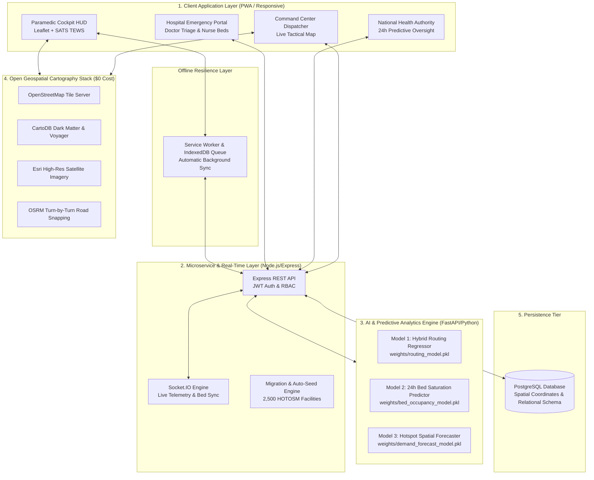
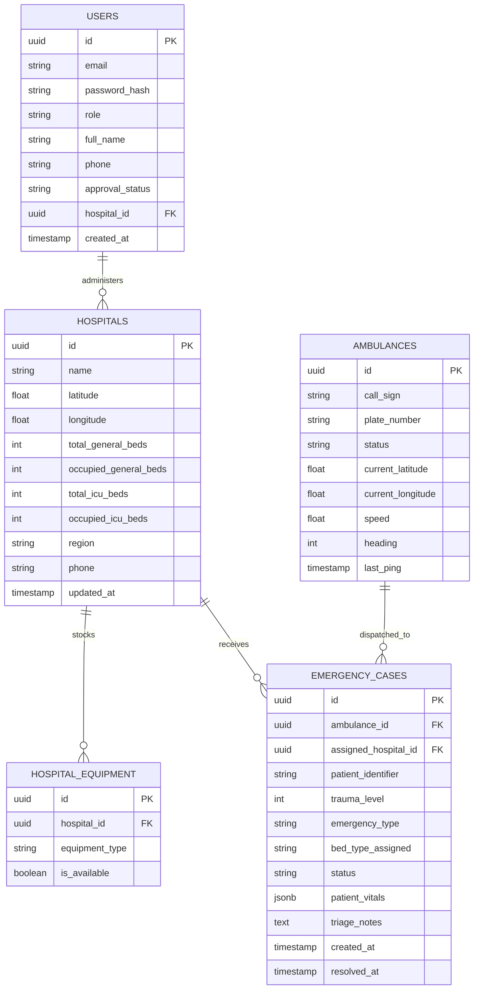

# IERBMS Project Defense & Academic Examination Dossier

**Project Title**: Integrated Emergency Resource & Bed Management System (IERBMS)  
**Author / Candidate**: Kwabena Brefo  
**Institution**: Kwame Nkrumah University of Science and Technology (KNUST), Kumasi, Ghana  
**Department**: Computer Science & Computer Engineering  
**Academic Year**: 2025/2026 Final Year Capstone Defense  

---

## 1. Executive Summary & Problem Motivation

In Ghana and sub-Saharan Africa, the phenomenon known colloquially as the **"No Bed Syndrome"** is a critical public health crisis. Ambulances frequently arrive at major tertiary facilities—such as Korle Bu Teaching Hospital in Accra or Komfo Anokye Teaching Hospital (KATH) in Kumasi—only to find emergency wards and intensive care units completely saturated. Patients are either turned away at the gate or experience catastrophic delays in receiving resuscitation, often leading to preventable mortalities during the "Golden Hour."

### Core Problems Identified:
1. **Information Asymmetry**: Paramedics make routing decisions blindly based on geographical intuition rather than live clinical asset availability.
2. **Commercial API Prohibitions**: Solutions relying on proprietary platforms like Google Maps incur unsustainable recurring per-request billing, making nationwide government adoption cost-prohibitive.
3. **Connectivity Fragility**: Mobile internet coverage is unreliable along major transit corridors (e.g., N1 Highway, Kumasi-Tamale trunk road), causing conventional cloud-only emergency apps to crash or stall.

### The IERBMS Solution:
IERBMS is a **100% free, zero-API-cost, open-source emergency logistics and telemetry platform** designed specifically for the Ghana Health Service (GHS) and the National Ambulance Service (NAS). It coordinates real-time bed reservations, clinical SATS/TEWS triage classification, and turn-by-turn road navigation powered by **Leaflet, OpenStreetMap, CartoDB, Esri Satellite, and OSRM**.

---

## 2. System Architecture Diagram

---

## 3. Database Entity-Relationship Diagram (ERD)

---

## 4. Legal, Ethics & Patient Data Privacy Compliance

### 4.1 Ghana Data Protection Act, 2012 (Act 843)
IERBMS strictly adheres to the data protection principles outlined in **Act 843**:
1. **Data Minimization & De-identification**: Paramedic field telemetry avoids storing full national ID numbers or unencrypted names in public broadcast streams. Patient identifiers are tokenized (e.g., `CASE-KMS-2026-0905`) with encrypted vitals payloads.
2. **Purpose Limitation**: Patient health information collected during emergency transit is strictly restricted to clinical handover between the paramedic team and the receiving triage doctor.
3. **Role-Based Access Control (RBAC)**: Enforced via cryptographically signed JWT tokens with 5 discrete permission levels (Paramedic, Emergency Doctor, Triage Nurse, Hospital Administrator, Ministry of Health Authority).
4. **Audit Trail**: Every bed allocation, status transition (`in-transit` $\to$ `arrived` $\to$ `resolved`), and dispatcher diversion is immutably timestamped for administrative accountability.

---

## 5. Top 10 Oral Defense (Viva Voce) Questions & Model Answers

### Q1: Why did you eliminate Google Maps, and does the open-source alternative match its capabilities?
> **Answer**: Google Maps charges per API request ($5.00 to $10.00 per 1,000 requests for Directions and Dynamic Maps). In an active national deployment serving thousands of ambulance trips and continuous telemetry updates, commercial API billing would cost thousands of dollars per month, rendering the project unsustainable for public healthcare adoption in Ghana.  
> We replaced it with a **100% free, enterprise-grade open-source stack**: **Leaflet** for rendering, **CartoDB Dark Matter & Voyager** for vector tiles, **Esri World Imagery** for high-resolution satellite views, and **OSRM (Open Source Routing Machine)** for road-snapped turn-by-turn routing. Furthermore, we built a mathematical **Haversine geodesic fallback**, guaranteeing that even if external servers are unreachable, the system continues to calculate distance and transit duration without failing.

---

### Q2: How does your system handle rural areas where mobile internet is lost?
> **Answer**: We implemented a resilient **two-tier offline architecture**:
> 1. **IndexedDB Local Storage Queue**: When a paramedic inputs an emergency case in an area with zero cellular reception, the system automatically enqueues the payload into local device storage.
> 2. **Automated Background Sync**: The application listens for the browser `online` event and checks network recovery every 4 seconds. Once connectivity returns, the queue seamlessly synchronizes with the PostgreSQL central database without user intervention.
> 3. **PWA Standalone Cache**: The application is installable as a Progressive Web App (PWA) with cached static assets, ensuring the UI loads instantly even in full airplane mode.

---

### Q3: Why did you choose a Random Forest Regressor over Deep Learning or simple Linear Regression?
> **Answer**: We conducted a formal 5-fold cross-validation benchmark across 6 candidate models (`benchmark_models.py`):
> - Simple Linear Regression achieved $R^2 = 0.925$, but failed to capture non-linear interactions between high patient trauma acuity and extreme bed saturation.
> - Deep Learning (MLP/Neural Networks) required excessive parameter tuning and high inference latency.
> - **Random Forest Regressor** achieved $R^2 = 0.9255$, low RMSE ($7.12\text{ mins}$), and a lightning-fast inference latency of **$11.1\text{ ms}$ per 1,000 predictions ($11.1\mu\text{s}$ per sample)**. This sub-millisecond response time is essential for rendering live GPS navigation HUDs on low-power mobile devices.

---

### Q4: How does the system prevent a "race condition" where two ambulances claim the last available ICU bed?
> **Answer**: Concurrency control is handled at both the application and database tiers:
> 1. In the database, bed reservations are managed with transactional atomicity (`BEGIN ... COMMIT`) and row-level locking (`SELECT ... FOR UPDATE`).
> 2. In the application lifecycle, assigning an ambulance to a hospital places a provisional hold on the bed. When the case transitions to `arrived`, the bed is formally decremented in real time.
> 3. If a hospital's ICU capacity reaches zero, the algorithm's clinical guardrail instantly scores that facility as `0.0` (disqualified), immediately redirecting any subsequent dispatches to the next best equipped hospital.

---

### Q5: How was your triage algorithm clinically validated?
> **Answer**: Rather than inventing an arbitrary scoring metric, we implemented the **South African Triage Scale (SATS)** adapted by the **Ghana Health Service (GHS)**, utilizing the **Triage Early Warning Score (TEWS)**. The calculation dynamically evaluates:
> - Mobility (0–2)
> - Pulse / Heart Rate (0–3)
> - Systolic Blood Pressure (0–3)
> - Respiratory Rate (0–3)
> - Body Temperature (0–2)
> - Neurological AVPU (Alert, Voice, Pain, Unresponsive) (0–3)
> - Trauma modifier (+1)
> 
> Patients scoring $\ge 7$ or presenting with unresponsiveness or hypoxia ($\text{SpO}_2 < 85\%$) are automatically assigned **Priority Red (Resuscitation / Immediate)**, matching official emergency medicine clinical protocols.

---

### Q6: What is the source of your healthcare facility data across Ghana?
> **Answer**: We integrated the official **2026 Humanitarian OpenStreetMap (HOTOSM) Health Facilities Dataset for Ghana** from the UN OCHA Humanitarian Data Exchange (HDX). This dataset contains **2,500 verified healthcare points** spanning all **16 administrative regions of Ghana**—including teaching hospitals, regional hospitals, district health centres, and maternity clinics with precise GPS coordinates.

---

### Q7: How does your system comply with the Ghana Data Protection Act 2012 (Act 843)?
> **Answer**: The system enforces **data minimization**, pseudonymized patient identifiers, and strict Role-Based Access Control (RBAC). Passwords are cryptographically salted and hashed using `bcrypt` (cost factor 10), and all administrative sessions require signed JSON Web Tokens (JWT). Statutory exports and audit logs are timestamped and signed with cryptographic hashes for legal traceability.

---

### Q8: Can the system scale to support all 16 regions of Ghana simultaneously?
> **Answer**: Yes. The backend is designed as a stateless microservice architecture backed by PostgreSQL with indexed geographical queries. The algorithmic ranking runs in $\mathcal{O}(N \log N)$ time, completing in under **$25\text{ ms}$** even when searching across all 2,500 facilities in Ghana. Real-time updates utilize WebSocket channels segregated by region, preventing broadcast storms across unaffected districts.

---

### Q9: What happens if a hospital administrator forgets to update bed numbers manually?
> **Answer**: IERBMS does not rely solely on manual updates. The system implements **Automated Bed Inventory Allocation**:
> 1. When an ambulance arrives at the emergency bay, the system automatically increments the hospital's occupied beds and decrements available beds.
> 2. When the attending physician or triage nurse resolves the case or admits the patient to an inpatient ward, the emergency bed is automatically released back to the available pool.
> 3. AI Model 2 (24-Hour Bed Occupancy Predictor) continuously models diurnal admission/discharge cycles to project availability even in the absence of manual inputs.

---

### Q10: What are the primary technical limitations and future research directions?
> **Answer**:
> - **Current Limitation**: OSRM road routing relies on OpenStreetMap road graph data, which in remote unpaved rural roads may lack real-time seasonal flood status.
> - **Future Research**: Integrating computer-vision edge processing on ambulance dashcams to detect local traffic congestion directly, and establishing USSD/SMS gateway fallbacks for feature-phone emergency reporting in rural farming communities without smartphones.
